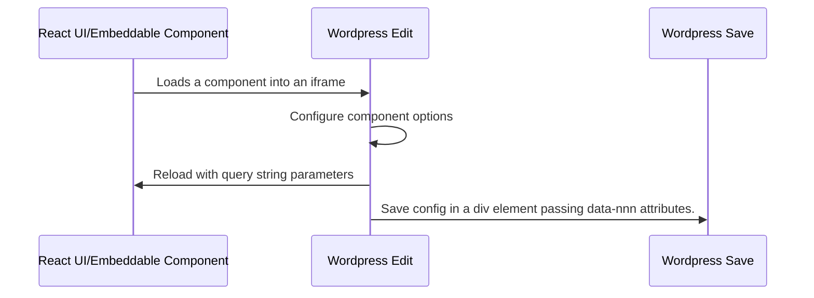
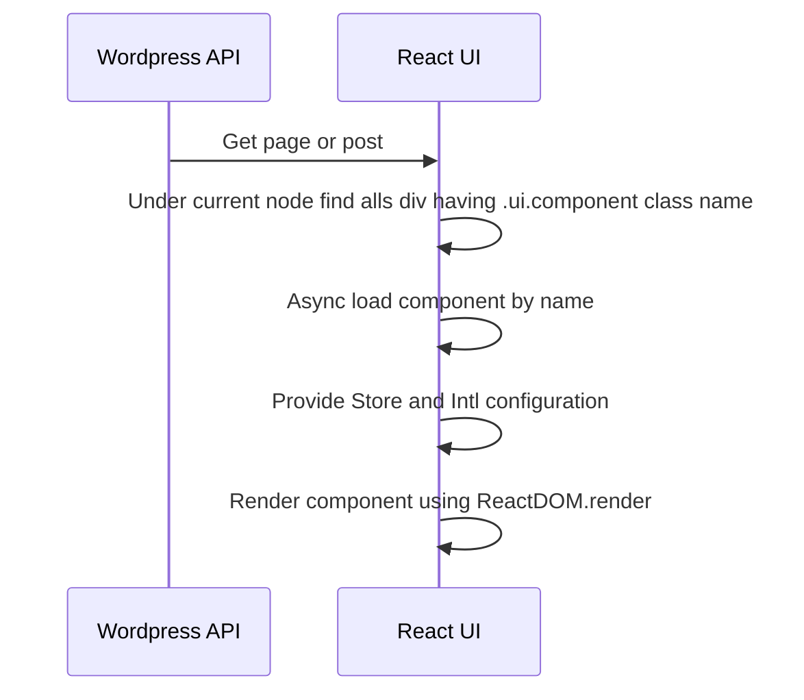

# WordPress React Lib
An easy way to integrate your react application with the world's **most popular** content management system . **wp-react-lib** uses the [Wordpress REST API](https://developer.wordpress.org/rest-api/) to load content into your classic React.js stack, it also allows embedding your own React.js components within pages and posts.

# Dependecies

wp-react-lib@0.1.0 uses  Redux and Immutable (*) , you need to configure your  store as the as the foll wing example:

import {applyMiddleware, compose, createStore} from 'redux'  
import {combineReducers} from 'redux-immutable';  
import {Map} from 'immutable'  
import thunk from 'redux-thunk'  
import {wordpress} from "wp-react-lib";

const initialState = Map()  
const getRootReducer = () => combineReducers({  
wordpress,  
})  
const store = createStore(  
getRootReducer(), // root reducer with router state      
initialState,  
compose(applyMiddleware(thunk))  
)

## Preparing WordPress

- Run dev_services.sh to start docker containers using development enviroment
- Open localhost
- Follow WordPress setup wizard
- Go to settings  permalinks, choose  day and name
  - *This configuration depends of your react routes setup*
- Go to appearance themes and activate wp-react-theme
  - *By activating this theme WordPress will disable its front-end*
- Go to pPugins and activate the following plugins
  - WP Multilang
  - WP-REST-API V2 Menus
  - **WP React Lib Components**
- Update .env file  accordingly
- run npm install
- run npm start

## Loading pages

     <Provider store={store}>  
	     
  
		     <PageProvider slug={"home"}>  
			     <PageConsumer> 
				     <Page/> 
			     </PageConsumer> 
		     </PageProvider> 
	     

     </Provider>

## Loading Posts

     <Provider store={store}>        
		     
    
               <PostProvider slug={"my-post-slug"}>    
                  <PostConsumer>   
                     <Post/>   
                  </PostConsumer>   
               </PostProvider>   
            
  
     </Provider>  

## Loading List of Posts

     const List = ({posts}) => {        return <ul>  
     {posts.map(post =>(<li> <h1 dangerouslySetInnerHTML={{__html: post.title.rendered}}/> </li>))} </ul>       }    
             
        function ShowPosts() {    
                return (    
                <Provider store={store}>    
                  
    
                     <PostProvider>    
                           <PostConsumer> <List></List>   
                     </PostConsumer>   
                  </PostProvider>   
                  
   
               </Provider>  );    
    }  
### Post Provider Properties

- type
- taxonomy,
- categories,
- before,
- perPage,
- page,
- fields,
- slug,
- store
- locale

## Embedded Components

You can  create and embed your own react components in WordPress editor, configure them, save its metadata, and render them in your React UI as part of your react application.

### Embedded Components Workflow

### Embeddable Components
To create an embeddable component you need
- Create your React component
- Add a route that exposes your component without your ui layout
- Create a wordpress plugin that wraps your component and put it available as a wordpress block.

Please look at **wp-react-example-advanced** and **wp-react-blocks-plugin**
