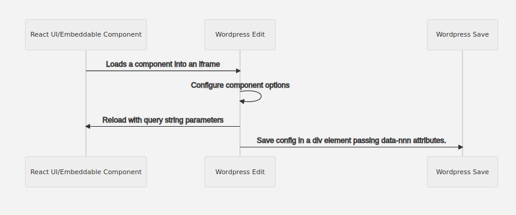
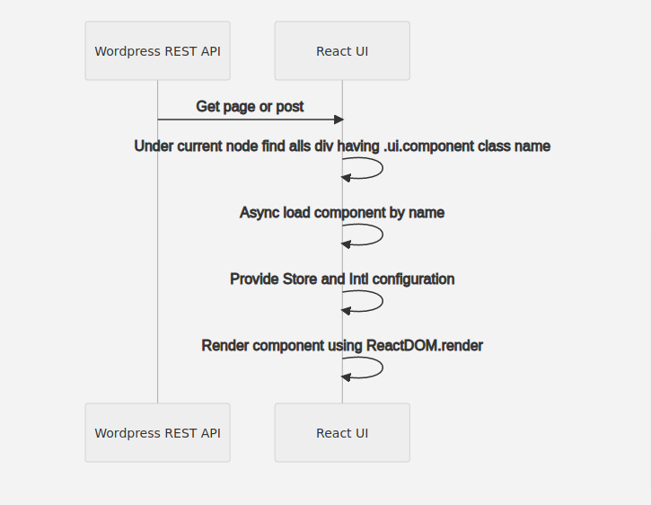

# WordPress React Lib
An easy way to integrate your react application with the world's **most popular** content management system. **wp-react-lib** uses the [Wordpress REST API](https://developer.wordpress.org/rest-api/) to load content into your classic React.js stack, it also allows embedding your own React.js components within pages and posts.

# Dependecies

wp-react-lib@0.1.0 uses  Redux and Immutable , you need to configure your  store as the following example:

    import {applyMiddleware, compose, createStore} from 'redux'  
    import {combineReducers} from 'redux-immutable';  
    import {Map} from 'immutable'  
    import thunk from 'redux-thunk'  
    import {wordpress} from "wp-react-lib";
    
    const initialState = Map()  
    const getRootReducer = () => combineReducers({  
      wordpress,  
    })  
    const store = createStore(  
      getRootReducer(), // root reducer with router state      
      initialState,  
      compose(applyMiddleware(thunk))  
    )
    

## Preparing WordPress

- Run dev_services.sh to start docker container using development enviroment
- Open localhost
- Follow WordPress setup wizard
  - Go to settings/permalinks, then choose day and name
    - *This configuration depends of your react routes setup*
  - Go to appearance/themes and activate wp-react-theme
    - *By activating this theme WordPress will disable its front-end*
  - Go to plugins and activate the following plugins
    - WP Multilang
    - WP-REST-API V2 Menus
    - **WP React Lib Components**
- Update .env file accordingly
- run npm install
- run npm start

## Loading pages

     <Provider store={store}>  
	     
  
		  <PageProvider slug={"home"}>  
			  <PageConsumer> 
				 <Page/> 
			  </PageConsumer> 
		  </PageProvider> 
	     

     </Provider>

## Loading Posts

     <Provider store={store}>        
        
    
           <PostProvider slug={"my-post-slug"}>    
              <PostConsumer>   
                 <Post/>   
              </PostConsumer>   
           </PostProvider>   
        
  
     </Provider>  

## Loading List of Posts

     const List = ({posts}) => {        
       return 
         <ul>  
           {posts.map(post =>(<li> <h1 dangerouslySetInnerHTML={{__html: post.title.rendered}}/> </li>))} 
	 </ul>
     }    
             
        function ShowPosts() {    
                return (    
                <Provider store={store}>    
                  
    
                     <PostProvider>    
                           <PostConsumer> <List></List>   
                     </PostConsumer>   
                  </PostProvider>   
                  
   
               </Provider> );    
    	}  
    
### Post Provider Properties

- type: You can specify your custom post type.
- taxonomy: Taxonomy used for filtering posts, categories is used by default.
- categories: Array of  categories ids for filtering the post by the taxonomy.
- before : ISO date used to filter posts by date before
- perPage: Number of post loaded per page
- page: Number of page that has to be returned.
- fields: Specify which field will be returned in the post object.
- slug: Filter by post slug.
- store: Specify the immutable path where returned posts will be stored, useful when having multiple  components loading different posts
- locale: Specify the post language (multiLang plugin required)

## Routing

*Using router for loading pages*

    <Route exact path="/:slug" render={(props)=>{  
        return (
  
			     <PageProvider slug={props.match.params.slug}>  
				     <PageConsumer> 
					     <Page></Page> 
				     </PageConsumer> 
			     </PageProvider> 
		     

	}}>  
    </Route>

*Using router for loading posts*

    <Route path="/:lan/:year/:month/:day/:slug/" exact render=
        {props => (  
             <PostProvider  slug={props.match.params.slug} >  
		     <PostConsumer> 
			     <Post></Post> 
		     </PostConsumer> 
	     </PostProvider> 
	 )}>  
    </Route>

## Embedded Components

You can  create and embed your own React components in WordPress editor, configure them, save its metadata, and render them in your React UI as part of your react application.

### Embedded Components Workflow

  
### Embeddable Components
To create an embeddable component you need
- Create your React component
- Add a route that exposes your component without your ui layout
- Create a wordpress plugin that wraps your component and put it available as a wordpress block.

Please look at **wp-react-example-advanced** and **wp-react-blocks-plugin**

## Contributing

For details about how to send pull requests, please read [CONTRIBUTING.md](https://github.com/devgateway/wp-react-lib/contributting.md).

## Autor

* **Seba Dimunzio** - *Architecture and code* - [sdimunzio](https://github.com/sdimunzio)

The list of all contributors to this project can be read at [contributors](https://github.com/devgateway/wp-react-lib/graphs/contributors). 

## License 📄

This project is under - Apache License 2.0 - for more details please check [Apache License 2.0](https://www.apache.org/licenses/LICENSE-2.0)

## Contact information

[For any comments or suggestions, please contact us](mailto:info@developmentgateway.org "Development Gateway's Email")
